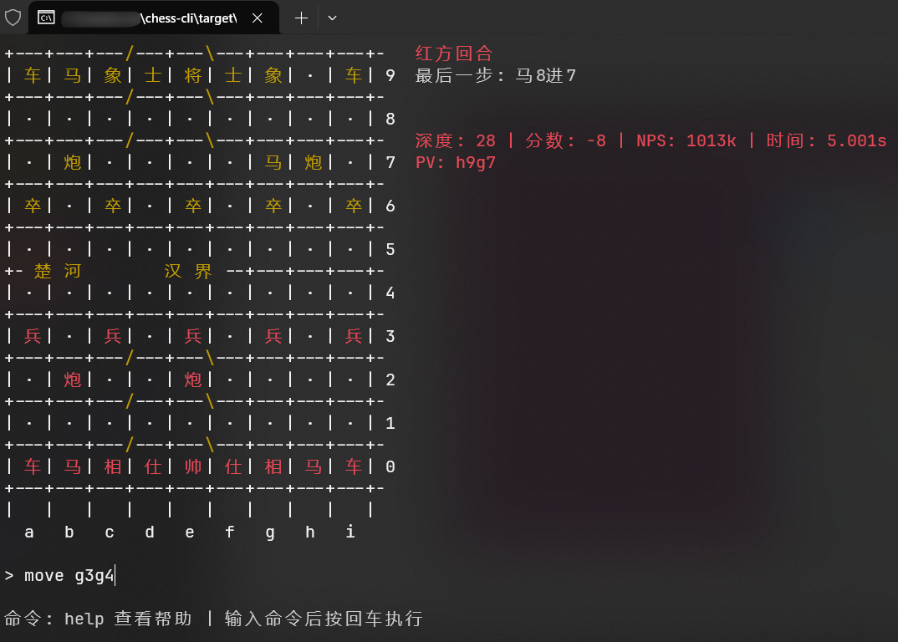

# Chess CLI
一个异步的跨平台(windows, macOS, Linux)的基于uci协议的中国象棋引擎命令行脚手架，致力于跨平台且在CMD中达到接近于GUI的体验，支持在CMD下启动多核象棋引擎，不再局限于使用Windows下的GUI来操作引擎。
[UCI协议](https://www.xqbase.com/protocol/cchess_ucci.htm)

# Features
- 支持引擎：
    - [皮卡鱼](https://www.pikafish.com/)

# License
本项目采用[GPL-3.0 license](LICENSE)协议开源。

# Usage
1. 下载[皮卡鱼](https://www.pikafish.com/)引擎，解压到当前目录下。
2. 编译指令:
   ```bash
   # windows
   cargo build --release    
   # linux
   cargo install cross
   cross build --target x86_64-unknown-linux-gnu --release 
   # macOS TODO
   ```
3. 将可执行文件，引擎和权重放在同一文件夹下，并设置`engines.toml`的路径。


# TODO
- [ ] 支持更多引擎
- [ ] 引擎后台思考
- [ ] 对局用时方案
- [ ] 支持开局库

# DEMO

Windows:



Linux:


